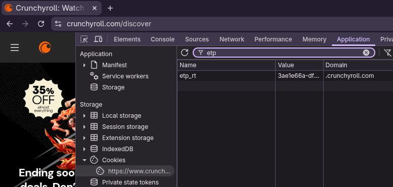

# Crunchyroll Downloader

[](https://github.com/CuteTenshii/crunchyroll-downloader/actions/workflows/tests.yml)
[](https://github.com/CuteTenshii/crunchyroll-downloader/releases/latest)
[](https://github.com/CuteTenshii/crunchyroll-downloader/releases)
[](go.mod)
[](LICENSE.txt)

Downloads anime from Crunchyroll and outputs them in a MKV file.

## Features

- Supports choosing the audio and subtitles language, including downloading multiple of each into a single file
- Supports explicit audio/video quality settings and automatic `best` selection
- Decrypts Widevine DRM (requires: a `.wvd` file or `client_id.bin` and `private_key.pem` files)
- Adds metadata (like episode name) to the MKV container
- Parallel segment downloads (10 workers) for faster downloads
- Retry with backoff on connection errors
- Batch download from a list of URLs

## Requirements

- [FFmpeg](https://www.ffmpeg.org/download.html#get-packages)
- To download Premium-only content, a Crunchyroll Premium account. No, this can't be bypassed and a free trial should be enough
- Either a `.wvd` file, or a `client_id.bin` and `private_key.pem`

## Download

Check the [latest release](https://github.com/CuteTenshii/crunchyroll-downloader/releases/latest) and download the file that corresponds to your OS.

## Usage

- Open a Terminal/Command prompt, and go to the folder where you downloaded the binary/cloned the repo
- Run the program with the options you want:
```shell
Usage of ./crunchyroll-downloader:
  -audio-lang string
        Audio language(s), comma-separated for multiple (e.g. "ja-JP,en-US"). First is the default track (default "ja-JP")
  -audio-quality string
        Audio quality (e.g. "192k" or "best") (default "192k")
  -cc-lang string
        Closed caption language(s), comma-separated for multiple (e.g. "en-US"). Downloaded in addition to --subs-lang, not instead of it
  -debug-manifest
        Log selected video/audio representations without URL credentials
  -download-delay duration
        Minimum delay between episode downloads, to help avoid Crunchyroll's rate limiting (e.g. "30s", "2m")
  -etp-rt string
        The "etp_rt" cookie value of your account
  -file string
        Path to a text file with one URL per line
  -season int
        Season number. Not used if an episode link is entered
  -subs-lang string
        Subtitle language(s), comma-separated for multiple (e.g. "en-US,es-419"). First is the default track (default "en-US")
  -url string
        URL of the episode/season to download
  -video-quality string
        Video quality (e.g. "1080p" or "best") (default "1080p")
```

Ex: to download the first season of *Hell's Paradise*:
```shell
./crunchyroll-downloader --url https://www.crunchyroll.com/series/GJ0H7Q5ZJ/hells-paradise --season 1 --etp-rt replace_this
```

To download a specific episode:
```shell
./crunchyroll-downloader --url https://www.crunchyroll.com/watch/GE00198973JAJP/dawn-and-confusion --etp-rt replace_this
```

To batch download from a file (one URL per line):
```shell
./crunchyroll-downloader --file list.txt --etp-rt replace_this --subs-lang pt-BR
```

To download multiple audio tracks and subtitles into a single file (the first of each is set as the default track). Unavailable languages are skipped with a warning; the episode is skipped if none of the requested audio languages are available:
```shell
./crunchyroll-downloader --url https://www.crunchyroll.com/watch/GE00198973JAJP/dawn-and-confusion --etp-rt replace_this --audio-lang ja-JP,en-US --subs-lang en-US,es-419,de-DE
```

If you're getting rate-limited while downloading a season/batch, wait at least this long between each episode:
```shell
./crunchyroll-downloader --url https://www.crunchyroll.com/series/GJ0H7Q5ZJ/hells-paradise --season 1 --etp-rt replace_this --download-delay 30s
```

If Crunchyroll rate-limits an episode anyway, it's retried in place (starting at `-download-delay`, or 1 minute if unset, doubling up to 30 minutes on repeated hits) instead of moving on to the next episode and tripping the same limit again.

### Quality selection

Defaults remain `-video-quality "1080p"` and `-audio-quality "192k"`. Use `best` explicitly to select the highest available quality:

- Video `best`: highest available height, then highest Bandwidth at that height. This also supports resolutions above 1080p, such as 1440p and 2160p.
- Explicit video quality, such as `720p` or `1080p`: highest Bandwidth at exactly that height.
- Audio `best`: highest Bandwidth within the selected audio AdaptationSet, independently for each requested language, without preferring a specific codec.
- Selection works with both SegmentTemplate and SegmentBase/on-demand manifests. If `best` finds no usable representation, the download reports an error instead of silently selecting a fallback.

Windows example (replace the URL and cookie placeholders locally):

```powershell
.\crdl-windows-fixed.exe -url "<URL>" -etp-rt "<YOUR_COOKIE>" -video-quality "best" -audio-quality "best" -audio-lang "ja-JP,en-US" -subs-lang "de-DE,en-US"
```

Add `-debug-manifest` to log the selected video resolution, Bandwidth and URL, plus the language, Bandwidth and codec of each selected audio track immediately before downloading. Video URL user information, query strings and fragments are omitted. Raw playback JSON and manifest XML are no longer printed.

## Building

### Requirements

- [Go](https://go.dev/dl/)

### Guide

- Clone this repository
- Open a Terminal/Command prompt, and go to the folder where you cloned the repo
- Run `go build .`

For the named Windows executable, run `go build -o crdl-windows-fixed.exe .` on Windows.

GitHub Actions builds for Linux, macOS and Windows and checks `go vet` and `gofmt`. This repository currently contains no Go test files.

## Help

### How do I get my `etp_rt` cookie?

- Go to https://crunchyroll.com
- Open Developer Tools
- Firefox: Go to *Storage* then *Cookies*<br />Chrome: Go to *Application* then *Cookies*
- Select the Crunchyroll domain, then copy the `etp_rt` cookie value



### What is a `.wvd` file and do I really need one?

Yes, Crunchyroll uses DRM-only content. This file is used to get a Widevine license, which gives the keys to decrypt the media.

If you don't have a rooted Android device or are just lazy, search "ready to use cdms" and you'll find plenty of websites providing those files.

## License

This project is licensed under the MIT License. See [LICENSE.txt](LICENSE.txt)
