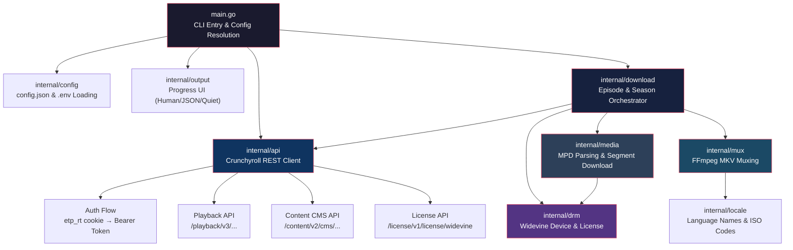

<!-- generated-by: gsd-doc-writer -->
---
title: Architecture
sidebar_position: 2
description: System architecture and component overview
---

# Architecture

## System Overview

Crunchyroll Downloader is a Go CLI application that downloads anime episodes from Crunchyroll, decrypts Widevine DRM-protected media streams, and muxes the resulting video, audio, and subtitle tracks into MKV files using FFmpeg. The architecture follows a layered pipeline pattern: configuration resolution → API authentication → content discovery → manifest parsing → DRM license acquisition → parallel segment download & decryption → FFmpeg muxing → output. The application is single-binary and designed for direct terminal usage with no runtime dependencies beyond FFmpeg.

## Component Diagram



## Data Flow

A typical download request flows through the system as follows:

1. **Configuration Resolution** — `main.go` parses CLI flags, loads `.env` via `config.LoadDotenv()`, then loads `config.json` via `config.Load()`. Values are resolved through a strict precedence chain: **CLI flag > environment variable > config file > built-in default**.

2. **Prerequisite Validation** — FFmpeg availability is verified via `checkFFmpeg()` before any network calls. Widevine device path is resolved and set via `drm.SetWidevinePath()` if provided.

3. **API Authentication** — `api.NewWithContext(ctx, etpRt)` constructs an HTTP client and immediately calls `fetchAccessToken()` using the `etp_rt` cookie. The response provides a bearer token stored in the `Client` struct. On 401 responses, the `Client.Do()` method transparently retries with a fresh token.

4. **Content Discovery** — Depending on the URL type (`/watch/` or `/series/`):
   - For `/watch/` URLs: `client.GetEpisodeInfo()` fetches metadata from `/content/v2/cms/objects/`, then `download.Episode()` handles the single episode.
   - For `/series/` URLs: `client.GetSeasons()` lists seasons from `/content/v2/cms/series/`, then `client.GetSeasonEpisodes()` fetches episode lists. `download.Season()` iterates over episodes sequentially.

5. **Playback Data Acquisition** — For each episode, `client.GetEpisode()` calls `/playback/v3/{id}/web/firefox/play`, returning a manifest URL, stream token, and subtitle URLs.

6. **Manifest Parsing** — The MPD manifest XML is fetched via `client.FetchManifest()` and parsed by `media.ParseManifest()` using the `go-mpd` library. The manifest contains AdaptationSets for video and audio streams, each with Representations at different quality levels, SegmentTemplate URLs, and ContentProtection (PSSH) data.

7. **DRM License Acquisition** — `drm.GetPssh()` extracts the PSSH (Protection System Specific Header) from the manifest. The Widevine device is loaded lazily via `sync.Once` in `drm.GetWidevineDevice()`. A CDM challenge is created, sent to Crunchyroll's license endpoint via `client.SendChallenge()`, and the response is parsed to extract decryption keys.

8. **Phase A — Sequential Base Download** — The first audio version's manifest is processed: PSSH is extracted, license keys are obtained, audio segments are downloaded in parallel and decrypted with Widevine, then video segments are downloaded in parallel and decrypted.

9. **Phase B — Parallel Additional Audio** — If multiple audio languages are requested (`versions[1..N]`), each additional audio track is downloaded concurrently using `errgroup`. Previously cached manifests are reused when available. Each goroutine fetches its own license keys and downloads/decrypts its own audio segments.

10. **Phase C — Muxing** — `mux.MergeEverything()` calls FFmpeg with the decrypted video file, all decrypted audio files, and all subtitle files. It maps tracks, copies codecs, sets language metadata via the locale package, marks the first audio/subtitle track as default, and writes global metadata (title, show name, season/episode number).

11. **Cleanup** — Stream tokens are deleted from Crunchyroll via `client.DeleteStream()` in a deferred function with a 10-second timeout. Temporary segment files (.mp4, .mp3, .ass) are removed. If the download failed, partial output files are also cleaned up.

## Key Abstractions

### `api.Client` (`internal/api/client.go`)
The central HTTP client wrapping `net/http.Client`. Holds the bearer token, device ID, and base URLs for Crunchyroll APIs. Implements automatic token refresh on 401 responses. Exposes methods for episode playback, content metadata, season/episode listing, manifest fetching, and Widevine license challenge submission.

### `config.Config` (`internal/config/config.go`)
Configuration model using Go pointer fields to distinguish between "not present" (nil) and "explicitly set" (non-nil). Supports merge semantics for layering configs. Used with `config.Merge()` to combine base config with per-command overrides.

### `output.Outputter` interface (`internal/output/output.go`)
Abstract output sink with three implementations:
- `humanOutput` — colored terminal output with ANSI escape codes, TTY detection, progress line overwriting
- `jsonOutput` — NDJSON streaming for programmatic consumption
- `quietOutput` — suppresses info and progress, shows only errors and warnings

The `Global` singleton is initialized once in `main()` based on `--json` and `--quiet` flags.

### `SpeedTracker` (`internal/output/speed.go`)
Rolling ring buffer of download speed samples (10-second window). Computes bytes-per-second averages and clamps ETA estimates to be non-increasing (never goes up), mitigating a common ETA oscillation pitfall.

### `drm.GetWidevineDevice()` (`internal/drm/drm.go`)
Lazy singleton loader for the Widevine device using `sync.Once`. Supports two device formats:
- `.wvd` files (packaged device format)
- Raw directories containing `client_id.bin` + `private_key.pem`

The device path is set via `drm.SetWidevinePath()` before any call to `GetWidevineDevice()`, following the configuration precedence chain.

### `media.mpdCache` (`internal/media/manifest.go`)
Thread-safe (RWMutex) cache for parsed MPD manifests, keyed by content ID. Avoids re-fetching and re-parsing manifests for additional audio language versions of the same episode.

### `media.DownloadParts()` (`internal/media/segment.go`)
Pulls media segments from CDN URLs in parallel using a worker pool (configurable via `--workers`). Builds segment URLs from `SegmentTemplate.Media` patterns, downloads with retry + exponential backoff, reassembles segments in order, writes to a temp file, then decrypts the assembled file using `widevine.DecryptMP4Auto()`.

### `mux.MergeEverything()` (`internal/mux/mux.go`)
Constructs and executes an FFmpeg command to mux video, audio, and subtitle streams into a single MKV file. Maps streams by type, copies codecs (no re-encoding), sets language metadata from `locale.LanguageCodes`, marks first tracks as default, and adds episode/series global metadata. Cleans up all temporary input files on success.

## Directory Structure Rationale

```
crunchyroll-downloader/
├── main.go                    # CLI entry point, flag parsing, config resolution, orchestration
├── main_test.go               # Integration tests for the CLI
├── config.json                # User-editable default configuration file
├── internal/
│   ├── api/                   # Crunchyroll REST API client — auth, playback, CMS, license
│   ├── config/                # JSON config file loading, .env parsing, precedence resolution
│   ├── download/              # Episode and season download orchestrators
│   ├── drm/                   # Widevine device management and CDM license acquisition
│   ├── locale/                # Language name → display name and ISO 639-2B code mappings
│   ├── media/                 # MPD manifest parsing, URL construction, segment downloading & decryption
│   ├── mux/                   # FFmpeg-based MKV muxing with metadata injection
│   └── output/                # Abstract output interface and implementations (human/JSON/quiet)
├── decrypt/                   # Standalone decryption utilities (separate from main pipeline)
├── testutil/                  # Shared test helpers and fixtures
└── dist/                      # Build output directory (gitignored)
```

The project follows the standard Go project layout with a flat `internal/` package structure. Each internal package has a single responsibility, enabling independent testing and future replacement. The separation between `media/` (segment download/decryption) and `mux/` (FFmpeg assembly) allows the download and decryption pipeline to be tested and profiled independently of the muxing step. The `api/`, `drm/`, and `media/` packages form the core three-phase pipeline (fetch metadata → decrypt license → download & decrypt content), while `download/` orchestrates across them and `mux/` handles final assembly.
